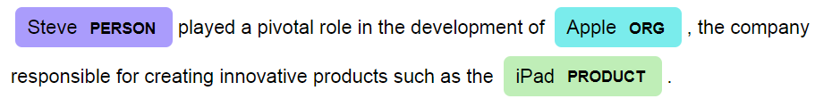

# Fast NER: Entity Recognition Training Module

> Simple is better than complex

Fast ner is a python module designed to help you train your own named entity recognition (NER) model quickly and easily. With fast NER, you can customize model your NER model by providing your own list of named entities.

##  Features

+ Easy-to-use API for training NER models
+ Ability to set language and load custom named entity lists
+ Automatic saving of trained model to disk

## Dependencies

fast_ner requires:

+ spacy (>= 3.5.0)
+ nltk (>=3.7)

## Installation

You can install Fast NER by runing the following command:

`pip install fast-ner`

## Usage

### Setting Up

To use Fast NER, you need to import the fast_ner module

`from fast_ner import Fast_NER`

### Initialize the Fast_NER object

Then, you need to create an instance of the fast_ner class:

`phrase = "Steve played a pivotal role in the development of Apple, the company responsible for creating innovative products such as the iPad"`

`fn = Fast_NER(language="en", phrase=phrase, save_model=False)`

The `language` parameter specifies the language of the text you want to train the model on (default is `"en"`). The `phrase` parameter is an exemple text phrase used to create a `Doc` object for training. The `save_model` parameter specifies whether to save the treined model to disk or not (default is True).

### Reading Named Entity Lists

Before training the model, you need to load entity list using the `read_json`

`ent_list = fn.read_json("entities.json")`

The named entity list should be a JSON file with a dictionary of entities and their labels with prefix `B-`. Here's an example:

`
{
"Apple":"B-ORG",
"Steve":"B-Person",
"iPad":"B-PRODUCT"
}
`
### Process a text with the loaded entities

Next, process your text data using the `process_text` method to obtain the list of words, spaces, and entity labels. Look how to do it:

`model = fn.process_text(ent_list)`

### Training the dat

Once you've processed your text data, you should train the model using the `train` method:

`fn.train(model)`

### Display the annotated text

Visualize the results of your model using the `show` method:

`fn.show()`

###### Here's the result:

## API Reference

`Fast_NER(language, phrase, save_model)`

Create an instance of the Fast_NER class.

### Parameters

+ `language` (string): Language for the NER model. Default is `"en"`.
+ `phrase` (string): Example text used for training.
+ `save_model` (bool): Whether to save the treined model to disk. Default is `false`

### Methods

`set_language(language)`: Set the language of the NER model.

#### Parameters

+ `language` (string): Language for NER model.

### Methods

`read_json(file)`: Load named entities from a JSON file.

#### Parameters

+ `file`(string): Path to JSON file containing named entities.

### Methods

`process_text(text)`: Process the entities obtained from the `read_json` to obtain the list of words, spaces, and entity labels.

#### Parameters

+ `ent_list` (object): Object processed with `read_json` method.

### Methods

`train(model)`: Train the NER model using the processed training data.

#### Parameters

+ `model` (object) : Object obtained from the `process_text` method.

### Methods

`show()` : Visualize the results of the trained model.

#### Parameters
+ None.

## Help and Support

### Comunication

+ Kayenga Campos - [Linkedin](https://linkedin.com/in/kayenga) | [Write Me](https://kayengacampos@gmail.com)

## License

This project is licensed under the [MIT License](https://opensourse.org/license/mit)
